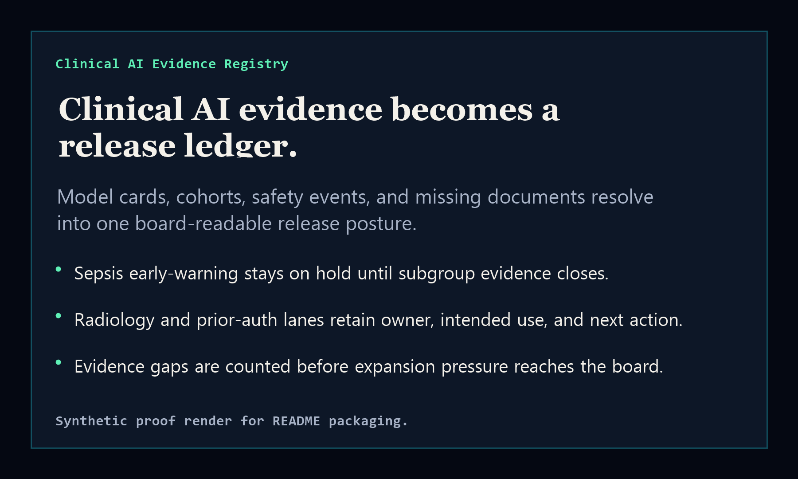
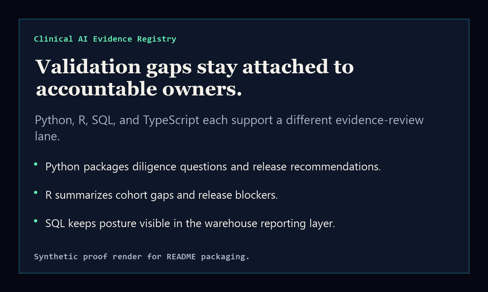

# clinical-ai-evidence-registry

[](https://github.com/mizcausevic-dev/clinical-ai-evidence-registry/actions/workflows/ci.yml)
[](LICENSE)

Clinical AI evidence registry for model cards, cohort coverage, safety events, unresolved bias findings, missing documents, and board-ready release posture.

## Why this exists

- Clinical AI teams often have evidence spread across model cards, validation memos, safety reviews, cohort notebooks, and release notes.
- Boards and executives need a compact release ledger: what is safe to expand, what stays on watch, and what is blocked.
- This repo connects Python diligence packs, R cohort summaries, SQL registry views, and a TypeScript executive surface.

## What it ships

- `Python` pack generator for diligence and release-readiness summaries.
- `R` cohort summary script for validation gap and release blocker analysis.
- `SQL` evidence registry views for warehouse-backed release posture.
- `TypeScript` scoring library and static executive registry surface.

## Local run

```bash
npm install
npm run verify
npm run prerender
node dist/app.js
```

## Python diligence pack

```bash
python python/clinical_ai_evidence_registry/pack.py fixtures/clinical-ai-evidence.json --format markdown
```

## R cohort summary

```bash
Rscript r/cohort_summary.R fixtures/clinical-ai-evidence.json
```

R is validated in CI with `r-lib/actions/setup-r`; local R is optional for TypeScript/Python verification.

## SQL registry

See `sql/evidence_views.sql` for the release-posture and board-summary views.

## Strategic fit

This is a Kinetic Gain Protocol-aligned HealthTech and Pharma surface: it turns AI model evidence into release decisions without exposing clinical records or protected health information.

## Screenshots



